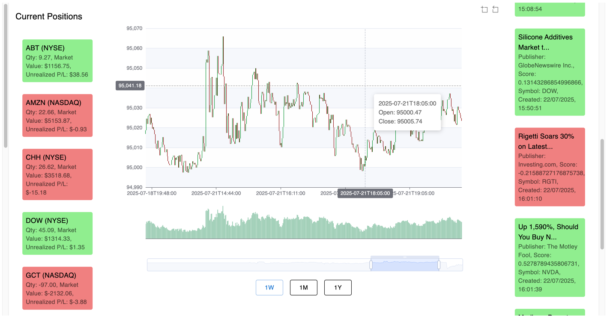

# Automated Trading System

This project is an **Automated Trading System** designed to analyse market news and execute trades based on sentiment analysis

## Features
- **Market News Analysis**: Periodically fetches relevant market news from [**Polygon API**](https://polygon.io/)
- **Sentiment Scoring**: Uses [**Stanford CoreNLP**](https://stanfordnlp.github.io/CoreNLP/) to assign a semantic score to each article
- **Automated Trading**:
    - Trades are executed through the [**Alpaca API**](https://alpaca.markets/)
    - Positive sentiment → **Buy transaction**
    - Negative sentiment → **Short transaction**
- **Trade Scheduling**: Trades are scheduled to be exited after a fixed duration of market exposure
- **User Interface**: A web-based dashboard to visualize trades, performance and market news

## Setup Instructions
1. Sign up for an account at [Alpaca](https://alpaca.markets/).
2. Obtain your **API Key ID** and **API Secret Key** from the Alpaca dashboard.
3. Set the following environment variables on your machine:
    ```bash
    export ALPACA_API_KEY_ID=your_alpaca_api_key_id
    export ALPACA_API_SECRET_KEY=your_alpaca_api_secret_key
    ```
4. Sign up for an account at [Polygon](https://polygon.io/).
5. Obtain your **API Key** from the Polygon dashboard.
6. Set the following environment variable on your machine:
    ```bash
    export POLYGON_API_KEY=your_polygon_api_key
    ```
7. Install [Docker Desktop](https://www.docker.com/products/docker-desktop).
8. Run the `docker-compose.yaml` file to start the MongoDB instance:
    ```bash
    docker-compose up
    ```
9. Open a terminal in the project root directory.
10. Run the following command to start the Spring Boot application:
    ```bash
    mvn spring-boot:run
    ```
11. Navigate to the `ui` directory:
    ```bash
    cd ui
    ```
12. Start the React development server:
    ```bash
    npm run dev
    ```


## Planned Features
- **Support for multiple news sources**: Integrate additional news APIs for broader market coverage
- **Reporter Reliance**: Implement trade performance tracking for each reporter to weight sources and dynamically size positions with a self
  adjusting feedback loop

## Technology Stack


